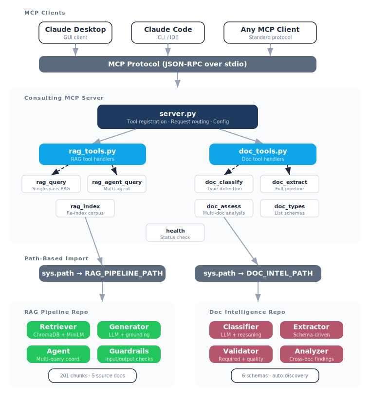

# Consulting MCP Server

MCP server that exposes three AI pipelines — [RAG Pipeline](https://github.com/Brinkv3/rag-pipeline), [Document Intelligence](https://github.com/Brinkv3/doc-intelligence), and [Agentic Audit](https://github.com/Brinkv3/agentic-audit) — as 11 composable tools for any MCP-compatible client.

This is the integration layer, not the intelligence layer. The intelligence lives in the pipeline repos. This server makes it consumable through a standard protocol.

## Architecture

<p align="center">
  
</p>

## Tools

### RAG Pipeline
| Tool | Description |
|------|-------------|
| `rag_query` | Single-pass RAG: retrieve + generate grounded answer with citations |
| `rag_agent_query` | Multi-agent RAG for complex, multi-part questions (slower, more thorough) |
| `rag_index` | Re-index a corpus directory into the vector store (destructive) |

### Document Intelligence
| Tool | Description |
|------|-------------|
| `doc_classify` | Classify a document by type (SOW, Contract, Project Plan, etc.) |
| `doc_extract` | Full single-doc pipeline: classify + extract structured fields + validate |
| `doc_assess` | Multi-document assessment with cross-document analysis and narrative |
| `doc_types` | List available document types and schemas (no API call) |

### Agentic Audit
| Tool | Description |
|------|-------------|
| `audit_generate_questions` | Generate interview questions from engagement documents |
| `audit_process_interview` | Process interview artifacts against a question framework (one app at a time) |
| `audit_synthesize` | Synthesize all results into an executive summary + Excel deliverable |

### Utility
| Tool | Description |
|------|-------------|
| `health` | Server health check: API key, vector store, schemas, pipeline status |

## Quick Start

### Prerequisites
- Python 3.12+
- Pipeline repos cloned locally (any subset — unavailable pipelines are skipped):
  - [rag-pipeline](https://github.com/Brinkv3/rag-pipeline)
  - [doc-intelligence](https://github.com/Brinkv3/doc-intelligence)
  - [agentic-audit](https://github.com/Brinkv3/agentic-audit)
- LLM provider config (`LLM_PROVIDER`, `LLM_MODEL`, `LLM_API_KEY`) set in environment or `.env`

### Setup

```bash
git clone https://github.com/Brinkv3/consulting-mcp-server.git
cd consulting-mcp-server

python3.12 -m venv .venv
source .venv/bin/activate

# Install server + pipeline dependencies
pip install -r requirements.txt
pip install "llm-adapter[anthropic] @ git+https://github.com/Brinkv3/llm-adapter.git" \
    chromadb sentence-transformers PyMuPDF python-docx \
    python-pptx openpyxl pandas tiktoken

# Configure pipeline paths
cp .env.example .env
# Edit .env with your actual paths and API key
```

### Connect to Claude Desktop

Copy the config into your Claude Desktop settings (`~/Library/Application Support/Claude/claude_desktop_config.json`):

```json
{
  "mcpServers": {
    "consulting-mcp-server": {
      "command": "/path/to/consulting-mcp-server/.venv/bin/python",
      "args": ["src/server.py"],
      "cwd": "/path/to/consulting-mcp-server",
      "env": {
        "RAG_PIPELINE_PATH": "/path/to/rag-pipeline",
        "DOC_INTEL_PATH": "/path/to/doc-intelligence",
        "AUDIT_PATH": "/path/to/agentic-audit",
        "LLM_PROVIDER": "anthropic",
        "LLM_MODEL": "claude-sonnet-4-6",
        "LLM_API_KEY": "your-key-here"
      }
    }
  }
}
```

See `config/claude_desktop_config.json` for a complete example.

### Connect to Claude Code

```bash
claude mcp add consulting-mcp-server \
  -e RAG_PIPELINE_PATH=/path/to/rag-pipeline \
  -e DOC_INTEL_PATH=/path/to/doc-intelligence \
  -e AUDIT_PATH=/path/to/agentic-audit \
  -- /path/to/consulting-mcp-server/.venv/bin/python src/server.py
```

### Verify

Once connected, ask Claude to run `health` — it reports the status of each component:

```
Server: running
RAG pipeline: available
Doc intelligence: available
Agentic audit: available
LLM provider: anthropic
LLM API key: set
Vector store: found
Schemas: found (6 types)
```

## Architecture

```
MCP Client (Claude Desktop / Claude Code / any MCP client)
      │ (MCP protocol over stdio)
      ▼
consulting-mcp-server
  ├── server.py         → MCP server entry point, tool registration
  ├── rag_tools.py      → Tool handlers wrapping RAG pipeline
  ├── doc_tools.py      → Tool handlers wrapping doc intelligence
  ├── audit_tools.py    → Tool handlers wrapping agentic audit
  └── utils.py          → Config, path validation, pipeline imports
      │                    │                    │
      ▼                    ▼                    ▼
  RAG Pipeline        Doc Intelligence     Agentic Audit
  (path-based import) (path-based import)  (path-based import)
```

All three pipelines use `src/` as their package name. The server imports them sequentially, flushing `sys.modules` between imports to avoid namespace collisions. Each pipeline is optional — if a path isn't configured, its tools report "unavailable" and the rest of the server works normally.

## Tests

```bash
source .venv/bin/activate
pytest tests/ -v
```

## License

[MIT](LICENSE) (c) 2026 Carter Brinkley Consulting LLC
